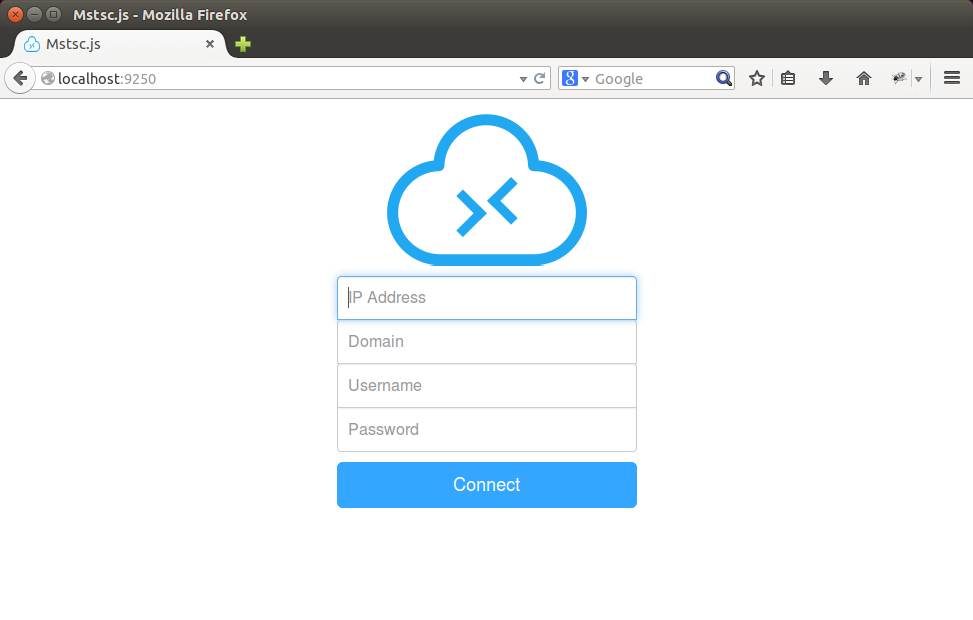
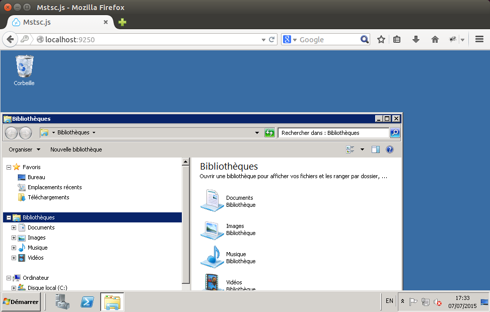

# mstsc.js


**Mstsc.js** is a pure javascript Microsoft RDP (Remote Desktop Client) client using nodejs, [**node-rdpjs**](https://github.com/citronneur/node-rdpjs) and socket.io. It allows you to connect to any terminal server compatible application, through a web browser (optimized for firefox, but compatible with chrome and internet explorer 11 too).





## Cozy-Cloud

Mstsc.js is designed to work with **Cozy-Cloud**!


[**Cozy**](http://cozy.io) is a platform that brings all your web services into the
same private space.  With it, your web apps and your devices can share data
easily, providing you
with a new experience. You can install Cozy on your own hardware where no one
is spying.

## Install

Install last release : 

```
npm install mstsc.js
```

Install last dev commit : 

```
git clone https://github.com/citronneur/mstsc.js
npm install
node server.js
```

## How does it works ?

### Frontend

The frontend application uses socket.io and canvas for binding with mstsc.js backend. The front-end is in charge of bitmap decompression through rle.js file. This file is generated by [**Emscripten**](https://github.com/kripken/emscripten) from [rle.c](https://raw.githubusercontent.com/citronneur/mstsc.js/master/obj/rle.c) which comes from rdesktop source.

### Backend

The backend application uses nodejs, express and socket.io as the web server. The main goal of the backend is to be a proxy between the web browser and the terminal server. It uses [**node-rdpjs**](https://github.com/citronneur/node-rdpjs) for its rdp client.


